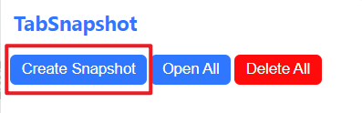
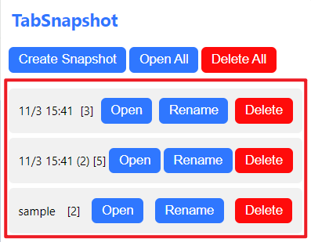
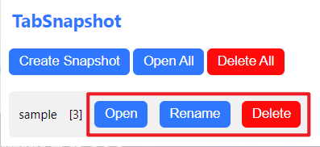
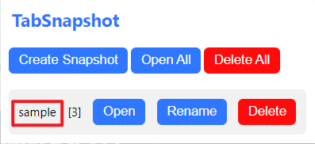
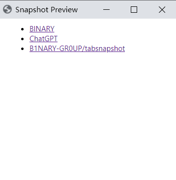
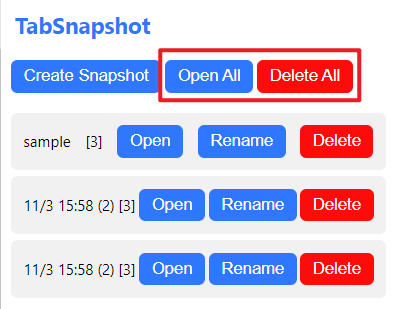

# TABSNAPSHOT

TABSNAPSHOT is a Chrome extension that allow you to create a snapshot for the current open tabs.

## Install

Since TABSNAPSHOT has not been released on the Chrome Web Store yet (it will be released later), you can install it using the following steps:

1. Download the source code zip file from the [releases](https://github.com/B1NARY-GR0UP/tabsnapshot/releases).
2. Extract the zip file to a location you prefer (usually where you store other software).
3. Open Chrome's `Extensions` page.
4. Turn on the `Developer mode` toggle in the upper right corner.
5. Click the `Load unpacked` button and select the source code folder you just extracted.
6. You will see that TABSNAPSHOT has been successfully installed in your Chrome.
7. Turn off developer mode.

## Usage

The current features supported by TABSNAPSHOT include:

- Save all currently open tabs in Chrome as a snapshot and store it.
- Open, Rename, and Delete saved snapshots.
- Preview saved snapshots.
- Open or Delete All saved snapshots at once.

**Note:** All TABSNAPSHOT features are integrated into the plugin's pop-up panel. Make sure to have TABSNAPSHOT properly installed and pinned to your Chrome for these functionalities.

### Create Snapshot

Click the `Create Snapshot` button in the TABSNAPSHOT pop-up panel to create a snapshot of all currently open tab pages in Chrome and save it:

### Open, Rename and Delete snapshot

All created snapshots will be displayed in a list format in the TABSNAPSHOT pop-up panel. The snapshots are named by default based on the creation time (down to the minute; if you create multiple snapshots within the same minute, they will be automatically numbered). The number displayed after each snapshot's name indicates the quantity of tabs included in the snapshot, for example, `[3]` means the snapshot contains three tabs:

You can open, rename, and delete snapshots using the `Open`, `Rename`, and `Delete` buttons next to each snapshot:

### Snapshot Preview

You can click on a snapshot to preview the tabs contained within it:

TABSNAPSHOT will open a separate window listing all the tabs included in the snapshot:

### Open and Delete All snapshots

Click `Open All` and `Delete All` in the TABSNAPSHOT pop-up panel to open or delete all saved snapshots at once:

## License

TABSNAPSHOT is distributed under the [Apache License 2.0](./LICENSE).

## ECOLOGY

  
TABSNAPSHOT is a Subproject of the <a href="https://github.com/B1NARY-GR0UP">Make Your Life Simpler</a>

