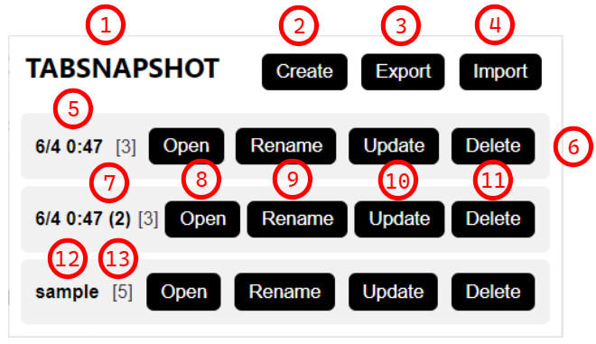

# TABSNAPSHOT

TABSNAPSHOT is a Chrome extension that allows you to create a snapshot for the current open tabs.

## Install

Since TABSNAPSHOT has not been released on the Chrome Web Store yet (it will be released later), you can install it using the following steps:

1. Download the source code zip file from the [releases](https://github.com/B1NARY-GR0UP/tabsnapshot/releases).
2. Extract the zip file to a location you prefer (usually where you store other software).
3. Open Chrome's `Extensions` page.
4. Turn on the `Developer mode` toggle in the upper right corner.
5. Click the `Load unpacked` button and select the source code folder you just extracted.
6. You will see that TABSNAPSHOT has been successfully installed in your Chrome.
7. Turn off developer mode.

## Usage

The current features supported by TABSNAPSHOT include:

- Save all currently open tabs in Chrome as a snapshot item.
- Open, Rename, Update and Delete saved snapshots.
- Preview saved snapshots.
- Open or Delete All saved snapshots at once.

**Note: All TABSNAPSHOT features are integrated into the plugin's pop-up panel. Make sure to have TABSNAPSHOT properly installed and pinned to your Chrome for these functionalities.**

1. The open-source address of the extension.

2. Use `Create` to capture a snapshot of all currently open tab pages in Chrome.

3. Use `Open All` to open all saved snapshots at once.

4. Use `Delete All` to delete all saved snapshots at once.

5. The snapshots are named by default based on the creation time (down to minute).

6. A saved snapshot item.

7. If you create multiple snapshots within the same minute, they will be automatically numbered.

8. Use `Open` to open a saved snapshot item.

9. Use `Rename` to rename a saved snapshot item.

10. Use `Update` to update a saved snapshot item.

11. Use `Delete` to delete a saved snapshot item.

12. Click on the snapshot's name in blue to open a preview window and view all the links saved in the snapshot item.

13. The number indicates the quantity of tabs included in the snapshot item.

## Blogs

- [How to Build Your Own Chrome Extension Using ChatGPT](https://dev.to/justlorain/how-to-build-your-own-chrome-extension-using-chatgpt-1pfa) | [中文](https://juejin.cn/post/7297124052175798308)

## License

TABSNAPSHOT is distributed under the [Apache License 2.0](./LICENSE).

## ECOLOGY

  
TABSNAPSHOT is a Subproject of the <a href="https://github.com/B1NARY-GR0UP">Make Your Life Simpler</a>

